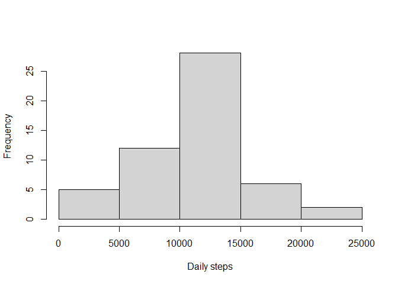
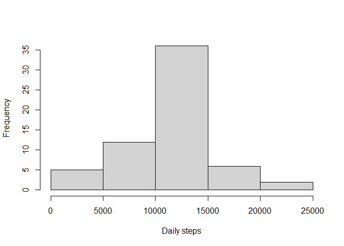
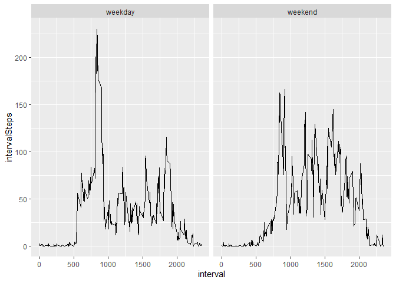

  
  
## Loading and preprocessing the data

```r
library(dplyr)
library(ggplot2)
db<-read.csv("activity.csv")
options(scipen=999)
```

## What is mean total number of steps taken per day?

```r
db2<-na.omit(db) %>%
  group_by(date) %>%
  summarise(dailySteps=sum(steps))

hist(db2$dailySteps,main="",xlab="Daily steps")
```

<!-- -->

```r
meanDailySteps<-round(mean(db2$dailySteps),2)
medianDailySteps<-round(median(db2$dailySteps),2)
```
The mean and median number of steps taken per day are 10766.19 and 10765, respectively.

## What is the average daily activity pattern?

```r
db3<-na.omit(db) %>%
  group_by(interval) %>% 
  summarise(intervalSteps=mean(steps))

plot(db3$interval,db3$intervalSteps,type="l",ylab="Average steps",xlab="5-minute interval")
```

<!-- -->

```r
maxInterval<-db3$interval[which.max(db3$intervalSteps)]
```
The interval 835, on average, contains the maximum number of steps

## Imputing missing values

```r
nas<-sum(is.na(db$steps))
db4<-db %>% 
  group_by(interval) %>% 
  mutate(imputeSteps=replace(steps,is.na(steps),mean(steps,na.rm=TRUE))) %>% 
  select(-steps) %>% 
  ungroup()

db5<-db4 %>% 
  group_by(date) %>%
  summarise(dailySteps=sum(imputeSteps))

hist(db5$dailySteps,main="",xlab="Daily steps")
```

<!-- -->

```r
meanDailyStepsI<-round(mean(db5$dailySteps),2)
medianDailyStepsI<-round(median(db5$dailySteps),2)
```
After imputing missing values, the mean and median number of steps taken per day are 10766.19 and 10766.19, respectively. Because of the simple imputing strategy, there is practically no difference in the results; the median value changed slightly.

## Are there differences in activity patterns between weekdays and weekends?

```r
db6<-db4 %>% 
  mutate(day=weekdays(as.Date(date))) %>% 
  mutate(typeOfDay=ifelse(day=="Saturday"|day=="Sunday","weekend","weekday")) %>%
  select(-day) %>% 
  mutate(typeOfDay=as.factor(typeOfDay)) %>%
  group_by(typeOfDay,interval) %>%
  summarise(intervalSteps=mean(imputeSteps))

ggplot(db6,aes(interval,intervalSteps)) +
  geom_line() +
  facet_wrap(~typeOfDay)
```

<!-- -->

